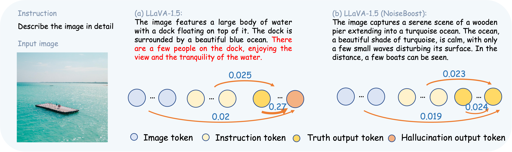
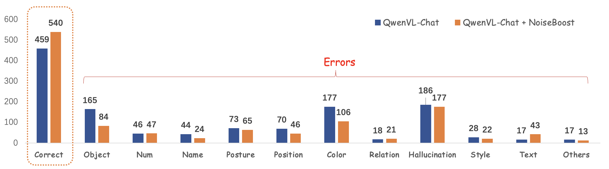
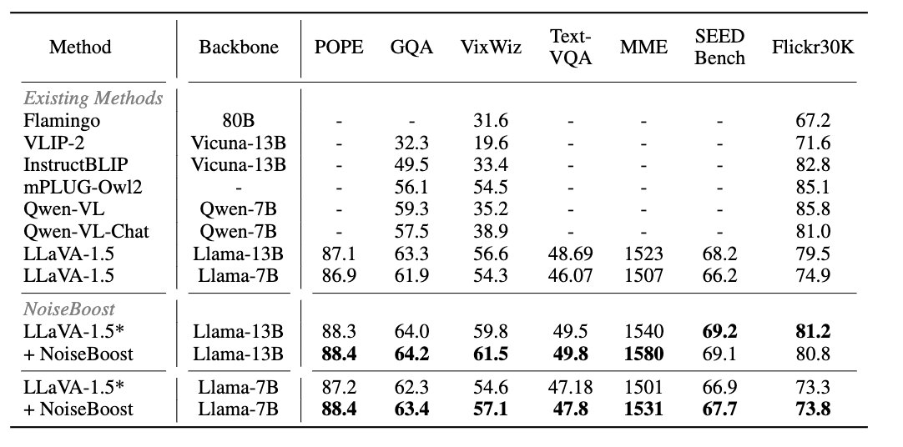
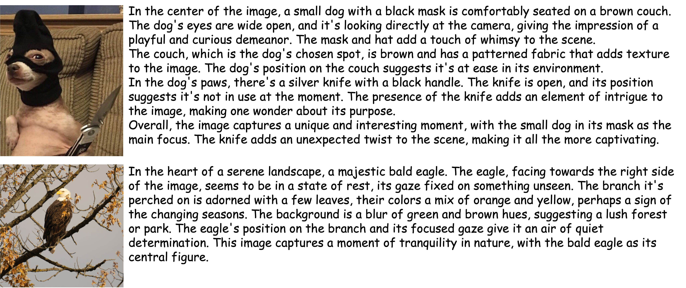

#  NoiseBoost: Alleviating Hallucination with Noise Perturbation for Multimodal Large Language Models

[\[Paper\]](https://arxiv.org/abs/2405.20081)  [\[Project Page\]](https://kaiwu5.github.io/noiseboost/)

#### The code and data will be released after the paper is accepted.

## What is NoiseBoost
NoiseBoost alleviates hallucination and boosts performance on multi-modal large language models with noise feature perturbation. MLLMs suffer from hallucinations due to the over-reliance on language priors. In (a), the
hallucination tokens are overly dependent (0.27) on previous language tokens, and later tokens are all
hallucinations. Meanwhile, in (b), NoiseBoost helps MLLMs distribute the attention weights evenly
among visual and language tokens by noise perturbation, leading to honest results




### Abstract
Multimodal large language models (MLLMs) contribute a powerful mechanism to understanding visual information building on large language models.
However, MLLMs are notorious for suffering from hallucinations, especially when generating lengthy, detailed descriptions for images.
Our analysis reveals that hallucinations stem from the inherent summarization mechanism of large language models, leading to excessive dependence on linguistic tokens while neglecting vision information. 
In this paper, we propose NoiseBoost, a broadly applicable and simple method for alleviating hallucinations for MLLMs through the integration of noise feature perturbations.
Noise perturbation acts as a regularizer, facilitating a balanced distribution of attention weights among visual and linguistic tokens.
Despite its simplicity, NoiseBoost consistently enhances the performance of MLLMs across common training strategies, including supervised fine-tuning and reinforcement learning.
Further, NoiseBoost pioneerly enables semi-supervised learning for MLLMs, unleashing the power of unlabeled data.
Comprehensive experiments demonstrate that NoiseBoost improves dense caption accuracy by 8.1\% with human evaluation and achieves comparable results with 50\% of the data by mining unlabeled data.


### Framework
Framework of NoiseBoost. We add noise perturbation to visual tokens to mitigate the over-reliance on language tokens and thus fewer hallucinations. For SFT, we directly inject noise to visual features. We only inject perturbation to preferred response since that can make MLLMs harder to learn and achieve better results. For semi-supervised learning, we use freezed MLLM as a teacher to generate pseudo labels and NoiseBoost as students for consistency regularization.


## What we can do?
### Boosting performance with human evaluation



### Model Enhancement


## ShowCases



## Citation
If you find this project useful in your research, please consider cite:

```BibTeX
Updating
```
